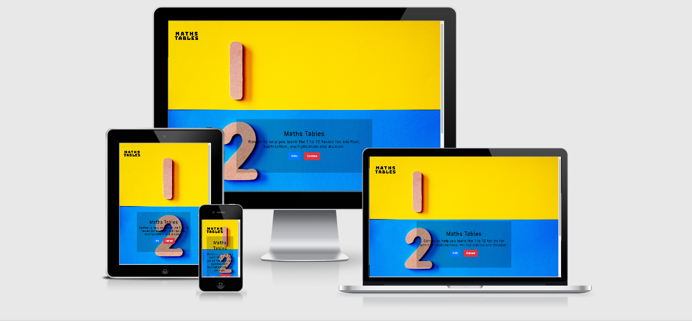

# Milestone Project 2
---
## Purpose

This site was designed for the second milestone project in Full Stack Software Development with the Code Institute, based on the learnings from HTML, CSS and User Centric Design,  JavaScript Fundamentals and Interactive Frontend Development modules.

---

## Maths Tables

I decided to create a maths game aimed at primary school children and 
their parents, to aid in the learning of the basic mathematics of 
addition, subtraction, multiplication and division. The idea came to me 
while home-schooling my children during COVID-19 enforced lockdown. 
The aim is to turn the learning experience into a game so that children 
are distracted and are learning at the same time. The game is based on 
the 1 to 12 tables that are taught in schools, by selecting the 
number and type of arithmetic to be used in the game random questions are
put to the user based on their selection. 

 The live website can be found here: https://smeghen.github.io/mathstables/

---
### User Experience (UX)

#### User Stories:
*As a Site User:*
* I want to immediately understand the nature of the site and be able to easily navigate through the site.
* I want to be easily able to understand the rules of the game.
* I want to be easily able to make a selection of  the type of game to play.
* I want to know if my answer is correct or incorrect.
* I want to track my progress during the game.
* I want to be able to access the site from all device types.

## Structure:
The main aim of this game is to create a fun learning tool for children, that is easy to navigate and easy to use. It should be appealing to users, but not distracting to the overall learning experience that the game provides. With this in mind I have designed a simple site with only limited navigation options.

The Home page will have a  bright colourful image, with simple text explaining the purpose of the game. There will be two buttons below the text that will mirror the navigations items in the header. These will be for information and start games.

The Info for the game will appear as a modal over the home page. This will give the instructions on how to select a game and start it. It will also detail the different game selection options.

The Games/Start Games option will again be a modal over the home page. Within this there will be bootstrap accordion for selecting either addition, subtraction, multiplication or division. There will also be a dropdown menu for selecting the table number (1-12) that will be used for the game.

The Game page will have a simple layout with a bright background and the maths questions displayed in large clear fonts. An input box will be clearly labelled for the answer to be entered into. At the top of the page score for the game will be displayed. On input a modal will appear confirming a correct or incorrect answer. For an incorrect guess, the correct answer will also be displayed. For both modals there will be options to either continue playing or return to the Home page.

## Design:

Colour scheme: 

The colour scheme for the site consists of Yellow, Blue and Red. These were chosen as they are bright colours to catch the attention of children, but not too distracting that they pull a user from the game play. The text will be Black as it will stand out best against these colours.

Typography:

The main font used throughout the site is Pangolin, which has a handwritten look about it that is less formal that other typed fonts. Sans Serif is used as a fallback font.

Imagery:
 
The site logo I created using Free Logo Design (https://www.freelogodesign.org/)

The home page image was taken by Magda Ehlers and I obtained it from Pexels

Wireframes:

Here is the wireframes that I used as the basis of the design
for the site. These were created using Balsamiq.

 For the pfd version of the wireframes click [here.](https://github.com/smeghen/mathstables/blob/master/assets/images/wireframe.pdf)
 

### Differences to Design

There were several changes to the original design that I had for the site. Firstly, 
I removed the navigation links from the Home page because they were making the page too busy on smaller
screen sizes and also I felt that with the same links being provided with buttons there was unnecessary
duplication. 

For the Game Selection modal and the game type selection, I changed the design from an accoridion to a 
dropdown menu, to mirror the table selection option. I felt that it made the modal much easier to understand 
the selection process and gave a better overall look to the modal. Within this modal I also added a selection 
confirmation display. This was done so that rather than going straight into the game, if the user made a 
mistake during selection it would be an oppurtunity to go back and change their selection.

On the Games Modal I had not original planned to have an End Game button and rely on the user to use the close
modal x to end the game. During development I felt that for ease of use of the game a button would be better to have 
and help with easier navigation of the site.

In the original design I had planned to have pop ups for both correct and incorrect answers. This I changed to used a pop up 
for incorrect answers only and instead went with a ping sound for the correct answer. The decision for this was based
on easier game play and giving the user the chance to have an instant acknowledgment of success. I retained the incorrect
pop up as there is a need to show the user the correct answer to the question, but I did decide to remove buttons and instead
the pop up can be closed by either clicking on the close x, clicking outside the pop up or the pop up closing itself
after 2 seconds display. Ease of use was the decision for these options.

Sounds were also added to not just the correct answer notification, but I also added a buzzer noise for and incorrect answer and 
a warning buzz for not making valid selections on the Game Select modal and not entering a guess on the Games modal. I felt
sounds would give an quick prompt to the target users for success and something not right, thus aiding in the overall experience 
of the site.

### Features to be Implemented in Future

* Extra games options like selecting all equation types or all table numbers, which
add extra difficulty.
* Add a time limit to the games.
* Move the number range beyond the 1 to 12 tables.
* Feedback form for sending comments on the games or suggestions for improvements/new games.

---
## Technologies Used
* HTML -  HTML is the main language used for the structure of the site.
* CSS - Custom written CSS is used to style the site.
* Bootstrap – The layout and styling of the site was help by the use of Bootstrap framework.
* Google Fonts -The font of Open Sans was imported from Google Fonts.
* Font Awesome – Was used to obtain the social media icons used.
* Balsamiq – Was used to create the wireframes of the site on the various devices.
* Adobe Photoshop Express - Used to resize images used on the site. https://www.adobe.com/ie/photoshop/online/resize-image.html
* Git - Git is used for the version control of changes throughout the project.
* GitPod – was used as the coding space for the project.
* Github - was used to host the project files and publish the live website by using Git Pages.
* Autoprefixer - was used to parse  CSS and add vendor prefixes to CSS rules via https://autoprefixer.github.io/
* W3 HTML Validation was done via https://validator.w3.org/
* W3 CSS Validation was done via https://jigsaw.w3.org/css-validator/
* Validation of JavaScript was done via https://jshint.com/
* Google Chrome DevTools – was used extensively during coding to check the responsiveness of the site with the addition of new features.
---
# Testing

After asking friends and family to test the site some feedback that I received was focused on the start button on the game modal. 
There was a little confusion as to how they could start the game by just entering numbers into the guess box without hitting the start
button. This prompted the incorrect answer modal to appear and the game would continue as normal, but the start button would not change to 
the end button so people found it hard to exit out of the game. This was recitify by removing the start button and beginning the game
once the game modal appeared.

Also, from feedback my error handling for the user guess was not robust enough. At first I was only checking for NaN, which is fine
not a blank text box and entering a nonnumerical character. But what was found was that by putting a number followed by a letter was 
being accepted as valid entry and returning a incorrect answer. This was rectified by changing the text box input table type to "number", 
so only numbers can be accepted in the guess box.

Another observation from a tester was on smaller screens it would be easier to use if the keypad for input to default to number keypad, I found the solution
on creativeblog.com. By setting the input pattern="[0-9]*" this will cover both android and iOS.

--- 

# Deployment

##  GitHub Project Creation
To create the project the following steps were used:

* In GitHub repositories section click the green 'New' button 
* Select the Code Institute template
* Name the repository and give a brief description
* Set repository to 'Public' to ensure the commit history is visible
* Click 'Create repository'

## Deploy with GitHub Pages
The website was deployed as follows:

* Open the repository in GitHub
* Navigate to the 'Settings' tab
* Scroll down to 'GitHub Pages' section
* Select 'Branch Master' as the source
* Click the save button
* Click on the link to go to the live deployed page

## Run Locally
To run the code locally:

* Navigate to the repository
* Click the 'Code' drop down menu
* Select to copy the GitHub URL from HTTPS box or 'Download Zip'
* Open a new terminal and type 'git clone' command in the CLI and paste copied URL
* Alternatively, click 'Open with GitHub Desktop' and follow the steps to complete the clone
---
# Issues Encountered

* Came across a problem with my displayRandomNumber() function: 

 

function displayRandomNumber() { 

    let choice = document.getElementById("selectedType"); 

    let numChoice = document.getElementById("selectedNumber");  

    if (choice === "Addtion" || "Multiplication"){ 

    let firstNum = parseInt(Math.random() * 12) + 1; 

    document.getElementById("operand1").textContent = firstNum; 

    } else if(choice === "Subtraction"){ 

    let firstNum = parseInt(Math.random() * 12) + numChoice;   

    document.getElementById("operand1").textContent = firstNum; 

    } else if(choice === "Division"){ 

    let firstNum = parseInt(Math.random() * 12) * numChoice;  

    document.getElementById("operand1").textContent = firstNum; 

    } 

    }  

The first if statement was being confirmed true for all selections and returning the random number range of 1 to 12. Using chrome dev tools I was able to find that the variable of choice was not being defined correctly so it could not be used correctly in the if else statement. This was fixed by changing the variable declaration to: 

 

    let choice = document.getElementById("selectedType").value; 

Another issue with this function was the variable numChoice, when checking on devtools, found that it was a string and would not then work in the formula. This was overcome by converting it to a number using the function Number(). 

 

 Encountered an issue with the Subtraction equations. During some testing found that the random number generation would throw out a 0 from time to time. As you can’t divide 0 by a number and it is not part of the division tables this is technically an error in the game. I figured out that the problem was with my formula: 

    if(choice === "Division"){ 

    let firstNum = parseInt(Math.random() * 12) * numChoice;  

    document.getElementById("operand1").textContent = firstNum; 

    } 

This formula allows 0 to be picked and multiplying 0 by the numChoice will still return 0. Overcame this issue by adding a check on the random number being provided.
 If it is 0, the numChoice is the random number, which is the equivalent to adding 1 to the random number, as done for the other equations to keep the number range from 1 to 12. 

---

# Credits

Used Am I Responsive? website to get mockup image of site on various devices. http://ami.responsivedesign.is/?ref=producthunt

Sounds downloaded from https://bigsoundbank.com/

Code for taking input when either enter key or button click is used. https://www.tutorialspoint.com/how-to-trigger-a-button-click-on-keyboard-enter-with-javascript

Code to hide elements on click found on w3schools. https://www.w3schools.com/howto/howto_js_toggle_hide_show.asp

Code for validating dropdown menu selection found on Stackoverflow. https://stackoverflow.com/questions/15371162/javascript-dropdown-validation-and-alert 

Code found to get inputs from dropdown menu.  https://mkyong.com/javascript/javascript-get-selected-value-from-dropdown-list/

Code for calling a Modal to open using JavaScript. https://stackoverflow.com/questions/36672304/bootstrap-mymodal-modalshow-is-not-working

Background Image for site was a photo by Magda Ehlers taken from Pexels. https://www.pexels.com/photo/blue-red-and-yellow-stripe-surface-1329297/?utm_content=attributionCopyText&utm_medium=referral&utm_source=pexels

Input type and pattern for keypad display on small screens found at creativeblog.com. https://www.creativebloq.com/html5/12-html5-tricks-mobile-81412803

---

# Acknowledgments

* My Mentor, Gurjot Singh, for his feedback and support throughout the project.

* The Slack community for their support, encouragement and assistance in finding answers 
to my project problems.